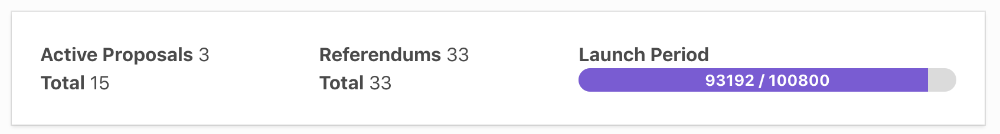
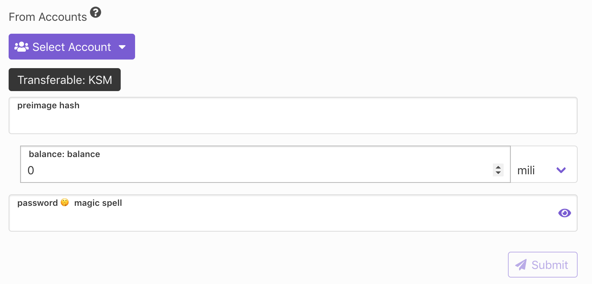
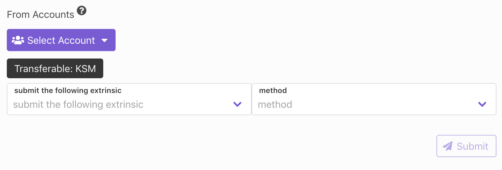

## 👋 Welcome

Democracy page consist of three sub-pages:
- Main Board
- Referendums
- Proposals

## Main Board
Main board is divided into two parts: **Summary** and and **Submits**

Summary is a small dashboard with all important information such as referendum count, proposal count and launch period

In submit part user is able to decide if he/she wants to submit proposal or preimage. 

When user wants to submit proposal, he/she needs to upload the `hash` of proposal and `balance` which will be locked for proposal. 

When user wants to submit preimage, he/she needs to select the `extrinsic` which will be added into preimage sumbittion.

## Proposals

Poposals tab shows list of avaible proposals 

As we can see on the image below each proposal consist of 
proposal id, proposer address, actual proposal and list of people which have seconded for actual proposal.

We are also able to second the proposal using `+ Second` button. 

## Referendums

Referendums tab is the list of proposed referendums.

Same as proposals referendum consist of vital information and users is able to vote for proposal using `+ Vote` button

