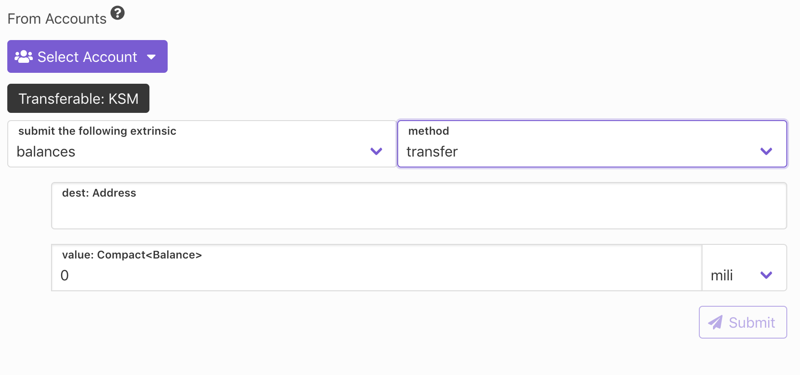

## 👋 Welcome

Extrinsics page is enviroment where user is able to execute every avaible transaction on the selected node.

## Usage

User selects `section` and `method` which should be executed, then fills out mandatory arguments for selected method and he/she is able to submit transaction.

As an example on the image below we selected `section: balances` and `method: transfer`. Transfer method requires two **arguments** `dest: address` and `value: number`

