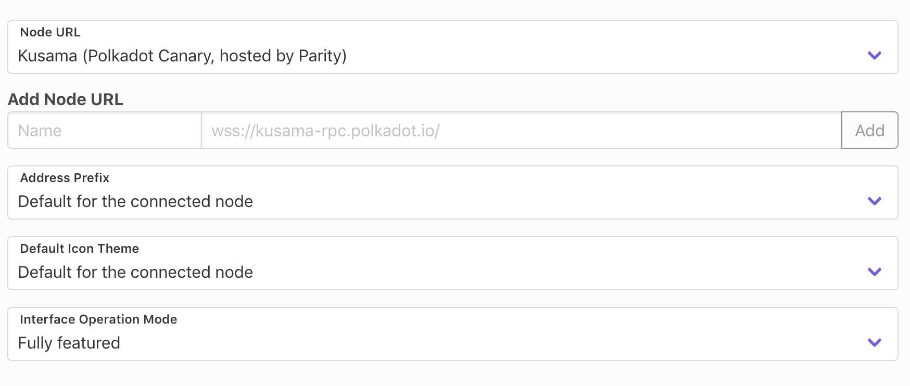

## 👋 Welcome

Vue Setting provide seamless integration of `vue-settings` and `vue-api` inside `Vuex`

Vuex integration allowed to change settings without need to reload app.

## Avaible settings

There are couple of settings avaible

- Change enpoint you are connected to
- Ability to add custom endpoint
- Set address prefix
- Select Identicon Theme
- Select operation mode

